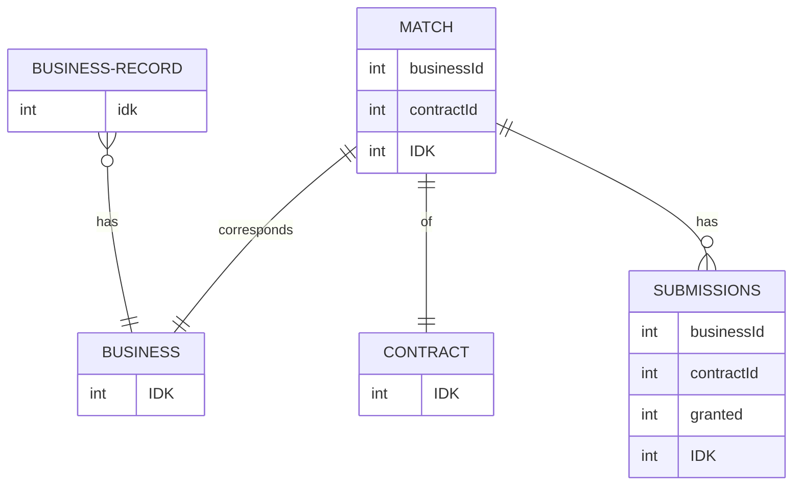

```mermaid
erDiagram

CONTRACT {
	int IDK
}

MATCH {
	int businessId
	int contractId
	int IDK
}

BUSINESS {
	int IDK
}

BUSINESS-RECORD {
	int idk
}

SUBMISSIONS {
	int businessId
	int contractId
	int granted
	int IDK
}


MATCH ||--|| BUSINESS : corresponds
MATCH ||--|| CONTRACT : of
MATCH ||--o{ SUBMISSIONS : has
BUSINESS-RECORD }o--|| BUSINESS : has
```
